# BawarchiKhana 
### A Food Exploration Application

An application to find food recipes according to the search category. This application can be used for saving favourite recipes.

## Demo Link

Visit the [BawarchiKhana Demo](https://bawarchi-khanna.vercel.app/) to see the application in action.

## Basic Outline

- [x] search for various recipes by a keyword
- [x] save favourite recipes 
- [x] store previous history
- [x] explore different varieties of foods and recipes

## Technology Used

- [x] React
- [x] Redux Toolkit and React Redux (for state management)
- [x] CSS
- [x] LocalStorage (as database)

## Steps to Launch the Code and Demo

1. Clone the repository.
2. Run `npm install` to install all dependencies.
3. Run `npm start` to start the application.
4. Open your browser and go to `http://localhost:3000/` to view the application.

## Screenshots

### Mobile View

  

    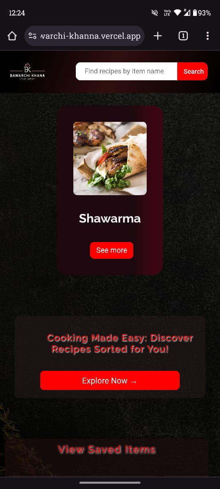
  

  

    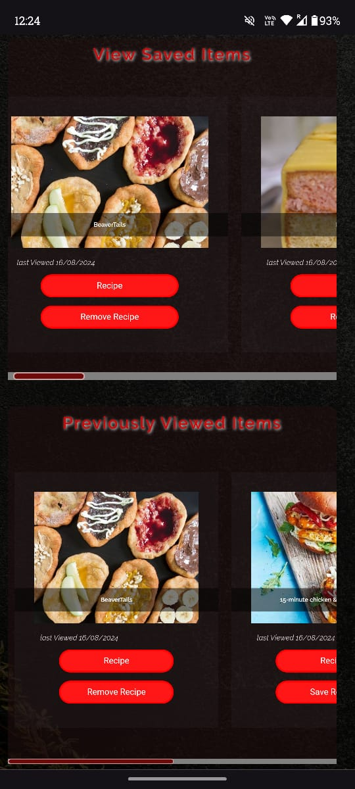
  

  

    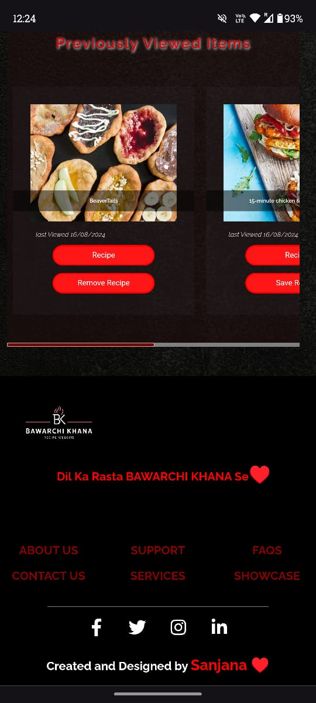
  

  

    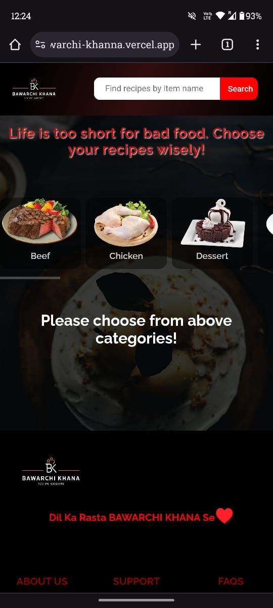
  

  

    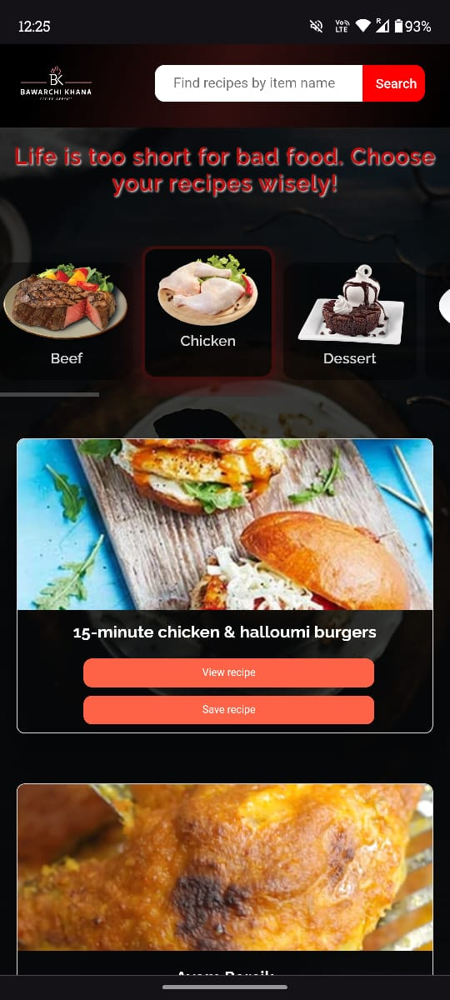
  

  

    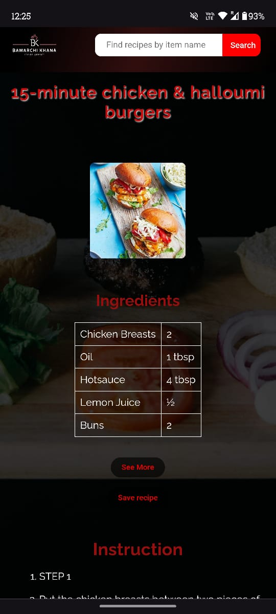
  

  

    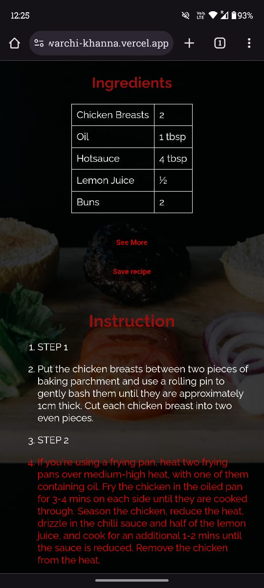
  

  

    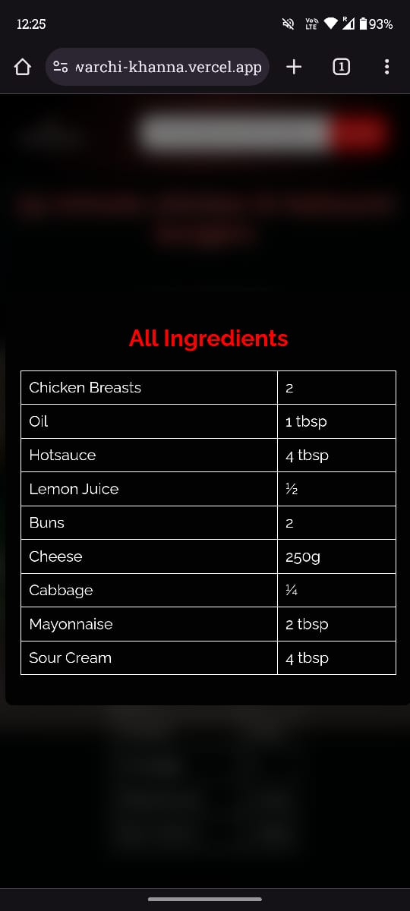
  

  

    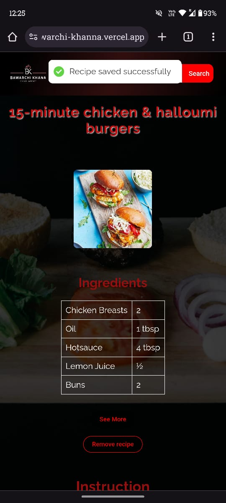
  

  

    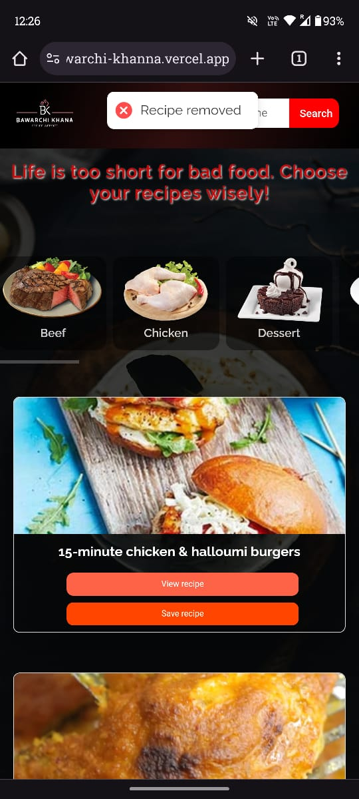
  

  

    
  

### Tablet View

  

    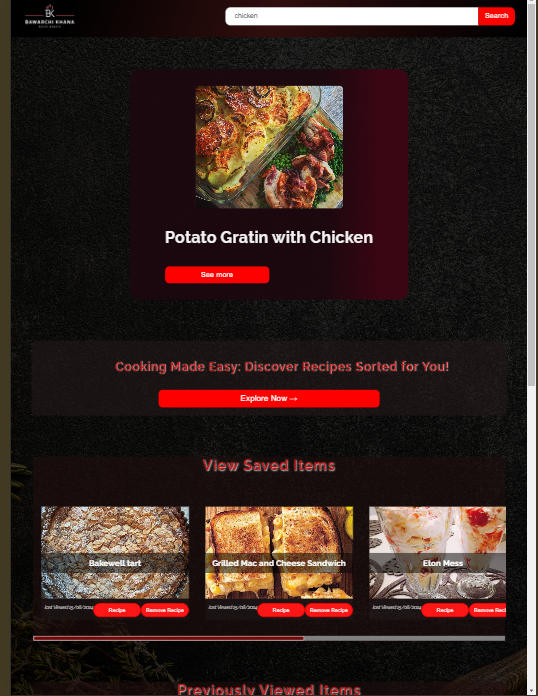
  

  

    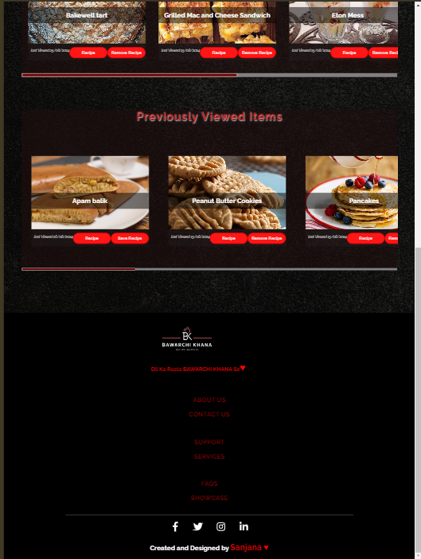
  

  

    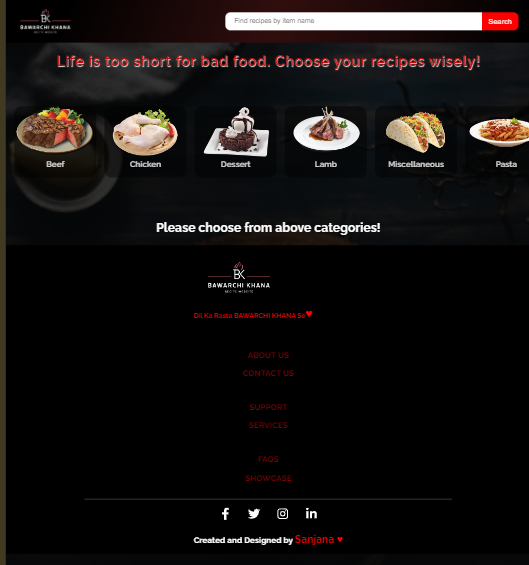
  

  

    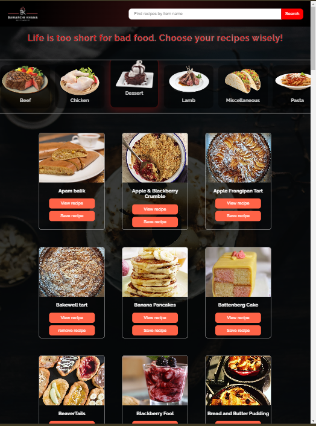
  

  

    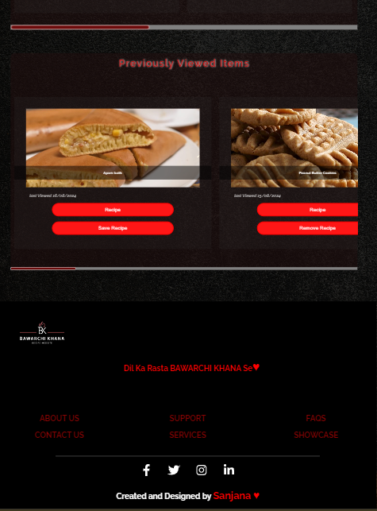
  

### Desktop View

  

    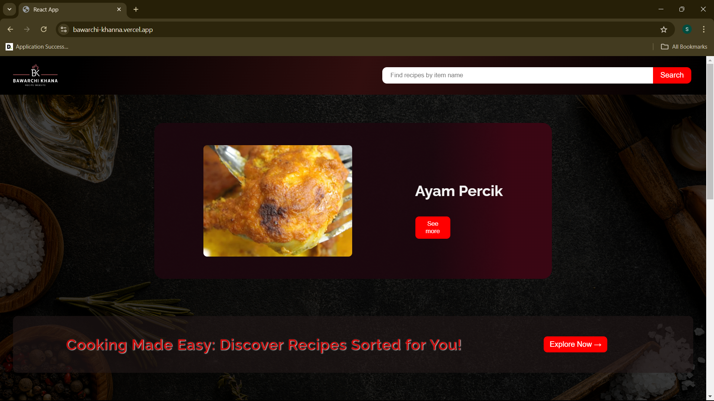
  

  

    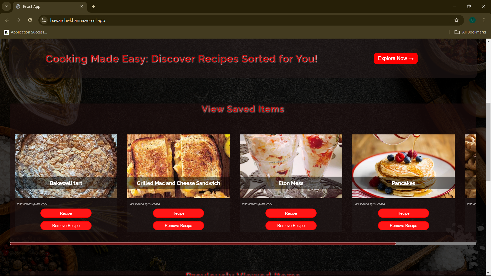
  

  

    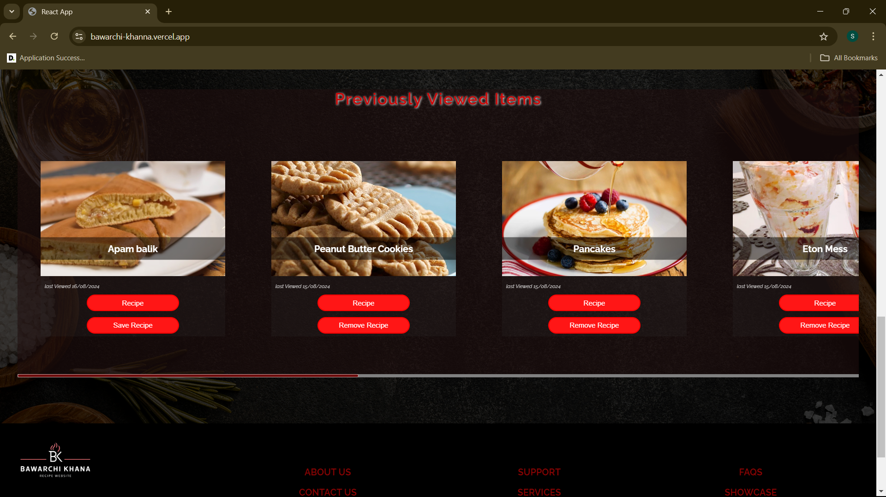
  

  

    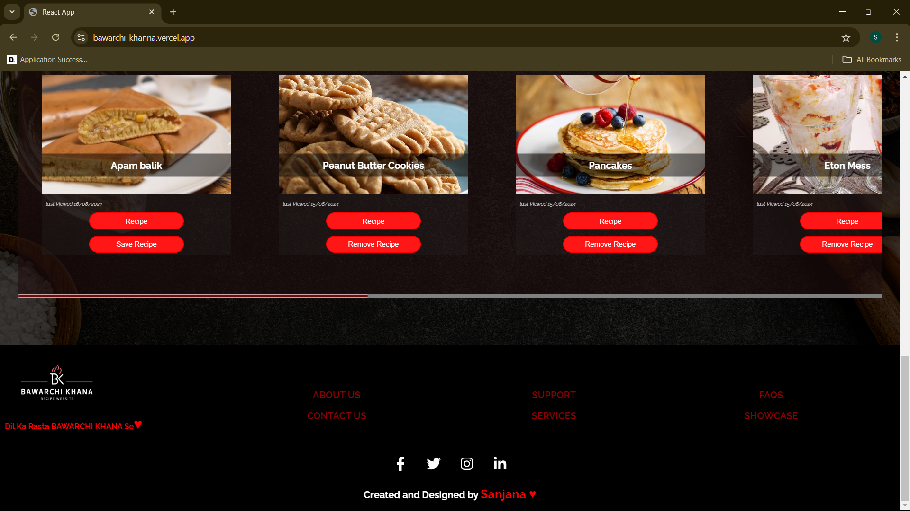
  

  

    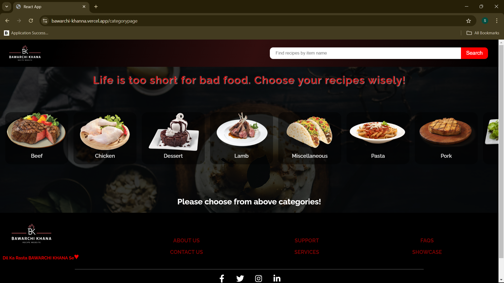
  

  

    
  

  

    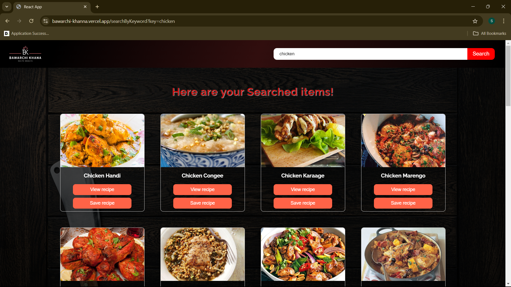
  

---

This is an overview of BawarchiKhana -'A Food Exploration Application', detailing its features, technologies used, how to launch the application, and screenshots showcasing its mobile, tablet, and desktop views.
